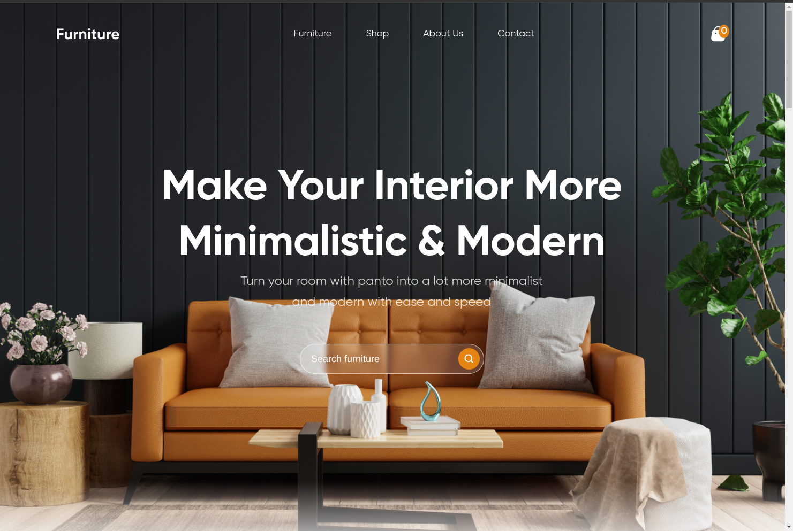
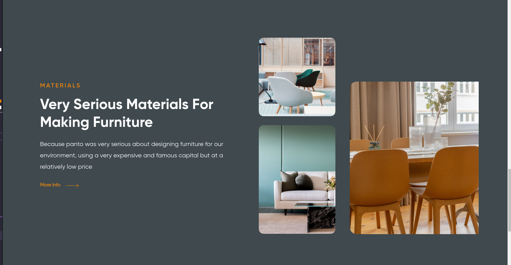
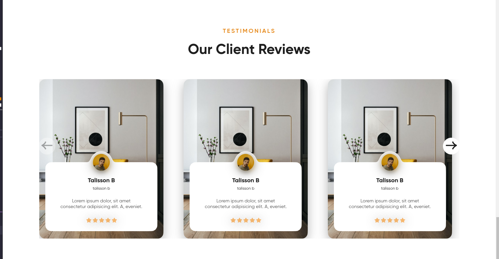

# Bem-vindo ao README do Projeto

Olá! Este é o README do projeto de uma loja de móveis moderna e performática desenvolvida com React e Sass.

## Descrição

Este projeto consiste em uma aplicação web para uma loja de móveis modernos. Foi desenvolvido utilizando React como biblioteca JavaScript para construção da interface do usuário e Sass para estilização, visando uma experiência de usuário atraente e moderna.

## Características

- **Design Moderno:** A interface foi projetada seguindo os princípios de design moderno para proporcionar uma experiência visualmente atraente aos usuários.
- **Desempenho Otimizado:** Utiliza práticas de desenvolvimento para garantir alta performance, proporcionando uma experiência fluida de navegação e interação.
- **Integração com React:** Aproveita as vantagens oferecidas pelo React para criar componentes reutilizáveis e uma arquitetura robusta.

## Instalação

Para instalar e executar este projeto, siga os seguintes passos:

1. Clone este repositório em sua máquina local:
   `bash
    git clone https://github.com/Talisson-b99/landing-page-desafio_07
.git
    `
2. Instale as dependências do projeto:
   ```bash
   npm install
   ```
3. Inicie a aplicação:
   ```bash
   npm start
   ```
4. Acesse a aplicação no navegador através do endereço: `http://localhost:5173`.

## Uso

Após iniciar a aplicação, você poderá navegar pela loja de móveis, visualizar os produtos disponíveis e interagir com a interface para explorar as funcionalidades oferecidas.

## Apresentação do Projeto







## Contribuição

Contribuições são bem-vindas! Se você tem ideias para melhorar este projeto, por favor, abra uma _issue_ para discutir suas ideias antes de efetuar qualquer alteração. Você também pode contribuir diretamente seguindo os passos abaixo:

1. Faça um _fork_ do projeto.
2. Crie uma nova _branch_ (`git checkout -b feature/MinhaFeature`).
3. Faça _commits_ das suas alterações (`git commit -m 'Adicionar MinhaFeature'`).
4. Faça _push_ para a sua _branch_ (`git push origin feature/MinhaFeature`).
5. Abra um _pull request_.

## Contato

Se você tiver dúvidas, sugestões ou comentários, não hesite em entrar em contato através do e-mail talissonb422@gmail.com.

Obrigado por utilizar nosso projeto! 😊
